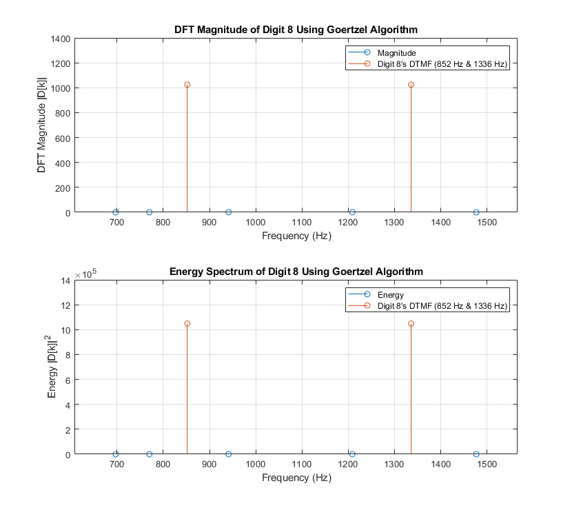
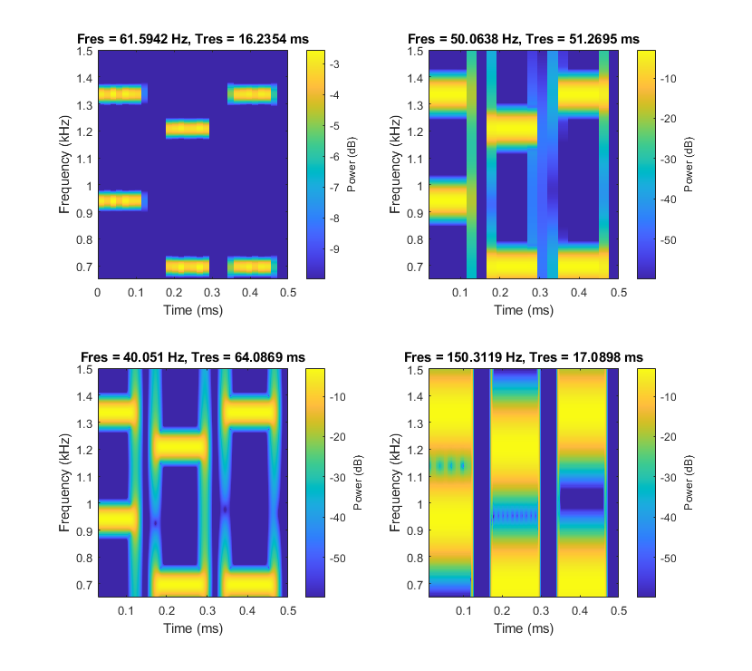

# Dual-Tone Multi-Frequency (DTMF)
- Dual-tone multi-frequency (DTMF) - The basis for voice communications control and is used worldwide in modern telephony to dial numbers and configure switch board
- DTMF tone - Commonly known as a digit, is a signal consisting the sum of two sinusoid or tones with frequencies from two exclusive groups (low and high group frequency)
  
  A DTMF signal is expressed as $d_N[n] = sin(\omega_on) + sin(\omega_1n)$, where $d_N[n]$ is the digit of keypad of a discrete time index $n$, and $\omega_o$ and $\omega_1$ are the low and high DTMF in radians/sample.
  
  By using $ω_{o/1} = 2 \times \pi \times f_n$ and the normalized frequency $f_n = \frac {f_{L/H}}{F_s}$, a DTMF signal is expressed as $d_N[n] = sin(2 \times \pi \times \frac {f_{L}}{F_s} \times n) + sin(2 \times \pi \times \frac {f_{H}}{F_s} \times n)$ in Hz.
- Frequencies are chosen to prevent any harmonic from being incorrectly detected by the receiver as some other DTMF tone

***DTFT[^1] Frequencies for Digits Sampled at F<sub>s</sub> = 8192 Hz***
|  | 1209 Hz | 1336 Hz | 1477 Hz |
| :-: | :-: | :-: | :-: |
| **697 Hz** | 1 | 2 | 3 |
| **770 Hz** | 4 | 5 | 6 |
| **852 Hz** | 7 | 8 | 9 |
| **941 Hz** | * | 0 | # |
- Ex: Digit 1 is represented by the signal $d_1[n] = sin(2 \times \pi \times \frac {697}{F_s} \times n) + sin(2 \times \pi \times \frac{1209}{F_s} \times n)$


# DFT Based Implementation
## DTMF Tones Corresponding to Digits 0-9 When Pressed on a Telephone Keypad[^2]
- Digits 0-9 are defined in a matrix called `dtmf` over interval $0 \le n \le 999$, where $n$ is the sample indices
  - The matrix stores each DTMF tone as a pair of frequencies defined as as $[f_L, f_H]$
- **Task:** Listen to each DTMF tone using the MATLAB function `sound`

### Results
*Note: First beep is Digit 0*

https://github.com/user-attachments/assets/d005f1db-a5e3-4964-b408-3e9c4b268e8b


## Corresponding Index $k$ for DTMF Digits[^2][^3]
- **Task:** Compute 2048 samples of $X(e^{j\omega})$ to determine its corresponding index $k$ using the MATLAB function `fft`[^4]
  
### Results
| Frequency (Hz) | Index $k$ |
| :-: | :-: |
| 697 | 175 |
| 770 | 193 |
| 852 | 214 |
| 941 | 236 |
| 1209 | 303 |
| 1336 | 335 |
| 1477 | 370 |


## Energy Spectrum of DTMF for Digit 8[^2]
**Energy Spectrum and Digit 8 Frequencies**
- $|X(e^{j\omega _k})|^2$ - Energy in a signal at frequency $\omega_k$
- Digit 8's DTMF - $f_L$ = 852 Hz and $f_H$ = 1336 Hz
- **Task:** Compute Digit 8's energy $|D_8(e^{j\omega _k})|^2$ using the MATLAB function `ftt`

### Results
***DFT Based Implementation's Magnitude & Energy***
| Frequency (Hz) | Magnitude | Energy |
| :-: | :-: | :-: |
| 697 | 1.9029 | 3.6209 |
| 770 | 13.015 | 169.39 |
| `852` | 500.51 | 2.5051e+05 |
| 941 | 7.1501 | 51.124 |
| 1209 | 6.9656 | 48.519 |
| `1336` | 500.26 | 2.5026e+05 |
| 1477 | 3.0512 | 9.3098 |

<br>

***Energy Spectrum of Digit 8 Using DFT Based Implementation***


## `ttdecode(x)` Function[^3]
- `ttdecode` - MATLAB function that accepts a touch-tone signal as the input with 1000 samples for each digit and is separated by 100 samples of silence, and decodes the input to return it as a phone number
- **Task:** Test the MATLAB function `ttdecode` on the signals

### Results
> Test output to ensure the code can output all digits: 1     2     3     4     5     6     7     8     9     0

> Output that satisfies the scope of the project: 5     5     5     7     3     1     9


## `ttdecode2(x)` Function[^3]
- `ttdecode2` - MATLAB function that accepts a touch-tone signal as the input, where digits and silence can have varying lengths, and decodes the input to return it as a phone number
  - File contains two input signals that are vectors called `hardx1` and `hardx2`
- **Task:** Test the MATLAB function `ttdecode2` on the two input signals in `touch.mat`

### Results
> Digits from `hardx1`: 4  9  1  5  8  7  7

> Digits from `hardx2`: 2  5  3  1  0  0  0

# Goertzel Algorithm Based Decoder Implementation
## DFT Magnitude and Energy Spectrum of DTMF for Digit 8[^2]
- Goertzel algorithm - An efficent method to compute the spectrum of a signal when only a small number of spectral values or frequency bins needs computing
  - Full length of DFT does not need to be computed 
- **Task:** Compute Digit 8's DFT magnitude $|D_8[k]|$ and energy $|D_8[k]|^2$ using the MATLAB function `goertzel`[^5]

### Results
***Goertzel Algorithm's DFT Implementation's Magnitude & Energy***
| Frequency (Hz) | Magnitude | Energy |
| :-: | :-: | :-: |
| 697 | 5.4727e-12 | 2.9951e-23 |
| 770 | 8.1237e-13 | 6.5995e-25 |
| `852` | 1024 | 1.0486e+06 |
| 941 | 1.7206e-12 | 2.9604e-24 |
| 1209 | 1.419e-12 | 2.0135e-24 |
| `1336` | 1024 | 1.0486e+06 |
| 1477 | 6.9756e-13 | 4.8659e-25 |

<br>

***DFT Magnitude and Energy Spectrum of Digit 8 Using Goertzel Algorithm***



# Spectrogram
## Digit 012 Spectrogram[^2]
- `pspectrum` - MATLAB function that computes an FFT-based spectral estimate over each sliding window and visualizes how the frequency content of the signal changes over time[^7]  
  - Signals are divided into segments, known as windows, allowing better frequency resolution with longer segments and better time resolution with short segments due to the inverse relationship between frequency and time, expressed as $T = \frac {1}{F_s}$

  For a rectangular window, the frequency resolution is the width of the main lobe, expressed as $\Delta \omega = \frac {4\pi}{M+1}$ in radians or $\Delta F = \frac {\Delta \omega}{2\pi} \times Fs$ in Hz.

  The time resolution of a signal is expressed as $\Delta t = MT$, where $M$ is the number of samples in the the window.

- Digit 012 is chosen as a three-digit encoded test telephone number
- **Task:** Compute the spectrogram of a three-digit encoded test telephone number

### Results
*Note: A rectangular window (`Leakage = 1`) is used in `pspectrum` to improve frequency resolution*

***Digit 012 Signal in Time and Frequency Domain***


***Three-Digit DTMF Peak Frequencies***
| Digit | Low Frequency (Hz) | High Frequency (Hz) |
| :-: | :-: | :-: |
| 0 | 941 | 1336 |
| 1 | 697 | 1209 |
| 2 | 697 | 1336 |

<br>

***Power Spectra of Digits 0-2***


***Digit 012 DTMF Spectrograms***

*Note: Spectrograms with different [`pspectrum` parameters](https://github.com/eoommaa/DTMF/blob/23265028efedc3723cc8f73f632df4f716a25a4b/Spectrogram/dtmf_spectrogram.m#L125-L132)[^8]*

- Ex: Spectrogram 1 (Default Balance of $\Delta F$ & $\Delta t$)
```matlab
% Spectrogram 1: No ΔF & 0% overlap, 'pspectrum' will find a good balance bet ΔF & Δt according to the 3-digit signal length
pspectrum(full_signal,Fs,"spectrogram",Leakage=1,OverlapPercent=0, ...      % 0% overlap to see the signal duration and locations in time
    MinThreshold=-10,FrequencyLimits=[650, 1500]);                          % MinThreshold = -10dB to visualize the main freq components
```




[^1]: Discrete-Time Fourier Transform (DTFT). DTFT {x[n]} ⇔ DTFT<sup>-1</sup> {X(e<sup>jω</sup>)}
[^2]: Code by [`eoommaa`](https://github.com/eoommaa) ([`dtmf_a.m`](https://github.com/eoommaa/DTMF/blob/main/DTF%20Based%20Implementation/dtmf_a.m), [`dtmf_f.m`](https://github.com/eoommaa/DTMF/blob/main/DTF%20Based%20Implementation/dtmf_f.m),
[`dtmf_g.m`](https://github.com/eoommaa/DTMF/blob/main/DTF%20Based%20Implementation/dtmf_g.m), [`dtmf_goertzel_alg.m`](https://github.com/eoommaa/DTMF/blob/main/Goertzel%20Algorithm/dtmf_goertzel_alg.m),
& [`dtmf_spectrogram.m`](https://github.com/eoommaa/DTMF/blob/main/Spectrogram/dtmf_spectrogram.m))
[^3]: Code by [`TeddyDo915K`](https://github.com/TeddyDo915K) ([`dtmf_f.m`](https://github.com/eoommaa/DTMF/blob/main/DTF%20Based%20Implementation/dtmf_f.m), [`dtmf_h.m`](https://github.com/eoommaa/DTMF/blob/main/DTF%20Based%20Implementation/dtmf_h.m), & [`dtmf_i.m`](https://github.com/eoommaa/DTMF/blob/main/DTF%20Based%20Implementation/dtmf_i.m))
[^4]: [MATLAB function `fft` documentation](https://www.mathworks.com/help/matlab/ref/fft.html)
[^5]: [MATLAB function `goertzel` documentation](https://www.mathworks.com/help/signal/ref/goertzel.html?searchHighlight=Goertzel&s_tid=srchtitle_support_results_1_Goertzel)
[^6]: [DFT Estimation with the Goertzel Algorithm](https://www.mathworks.com/help/signal/ug/dft-estimation-with-the-goertzel-algorithm.html)
[^7]: [Practical Introduction to Time-Frequency Analysis MATLAB documentation](https://www.mathworks.com/help/signal/ug/practical-introduction-to-time-frequency-analysis.html)
[^8]: `pspectrum` Parameters (Spectrogram [1](https://github.com/eoommaa/DTMF/blob/95b5676741261cf0e957216341d240d338d8a714/Spectrogram/dtmf_spectrogram.m#L115-L116),
[2](https://github.com/eoommaa/DTMF/blob/95b5676741261cf0e957216341d240d338d8a714/Spectrogram/dtmf_spectrogram.m#L137-L138),
[3](https://github.com/eoommaa/DTMF/blob/95b5676741261cf0e957216341d240d338d8a714/Spectrogram/dtmf_spectrogram.m#L146-L147), &
[4](https://github.com/eoommaa/DTMF/blob/95b5676741261cf0e957216341d240d338d8a714/Spectrogram/dtmf_spectrogram.m#L155-L156))
